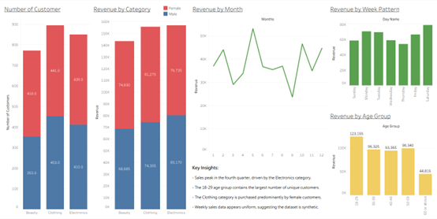

# Retail Sales Analysis Project
An end-to-end data analysis project of retail sales data, using SQL for data processing and Tableau for visualization.
* [View the Live Interactive Dashboard on Tableau Public](https://public.tableau.com/app/profile/chun.kit.lai2955/viz/Retail_Tableau_17554517649470/1_1?publish=yes)

---

## Project Overview
This project provides a comprehensive analysis of a retail dataset to identify key trends in sales, product performance, and customer demographics. The goal is to uncover actionable insights that can help drive business strategy.

---

## Tools Used
* **Database:** MySQL (for data transformation and aggregation)
* **Data Visualization:** Tableau Public (for creating the interactive dashboard)

---

## Data Source
The data used for this project is a synthetic retail sales dataset sourced from Kaggle. The dataset contains 1,000 records of individual sales transactions.

* **Link:** [Retail Sales Dataset on Kaggle](https://www.kaggle.com/datasets/mohammadtalib786/retail-sales-dataset)
---

## Data Analysis and Key Questions

The analysis was performed in SQL to answer five key business questions. The process involved creating custom groups using `CASE` statements, performing aggregations with `SUM()` and `COUNT(DISTINCT)`, and using Common Table Expressions (CTEs) to calculate gender-based sales percentages.

1.  **Seasonal Trends:** Which months are the high and low seasons for sales?
2.  **Weekly Patterns:** What is the sales trend across a typical week?
3.  **Product Performance:** Which product categories are the top sellers?
4.  **Demographic Analysis (Gender):** What is the gender split of sales within each product category?
5.  **Demographic Analysis (Age):** Which age groups are the most valuable customer segments?

---

## Key Insights & Recommendations

* **Insight:** Seasonal analysis reveals a significant sales peak in the fourth quarter (October-December).
    * **Recommendation:** The business should strategically increase inventory and marketing spend leading into Q4 to maximize revenue during the peak holiday season.

* **Insight:** The 18-29 age group contains the largest number of unique customers; however, the Millennial age group (28-42) is the most valuable, contributing the highest total revenue.
    * **Recommendation:** While continuing to target the high-spending Millennial segment, a campaign focused on increasing the average spend of the large 18-29 customer base could unlock significant growth.

* **Insight:** Electronics is the top-performing product category by a significant margin. While the gender split is relatively even in Electronics and Beauty, the Clothing category's sales are predominantly from female customers.
    * **Recommendation:** Secure the supply chain for top-selling electronic items. Launch a targeted marketing campaign for the men's clothing line to address the imbalance and capture potential market share.

* **Insight:** The analysis of weekly sales patterns shows a surprisingly flat trend. This is unusual for a retail business and suggests the dataset is synthetic.
    * **Recommendation:** For more accurate weekly trend analysis, the business should ensure it is capturing and utilizing real-world transactional data.

---

## Final Dashboard

